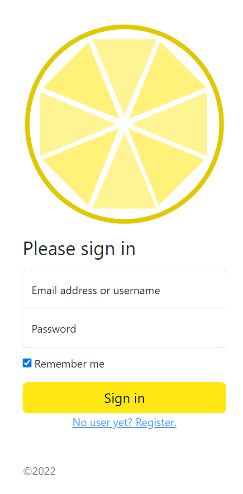
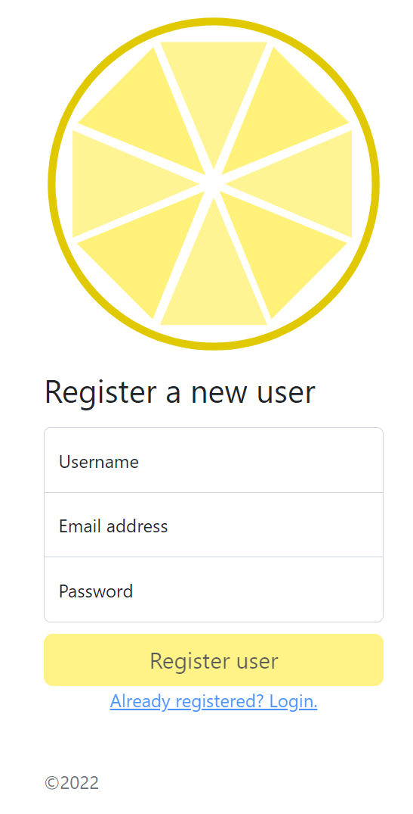
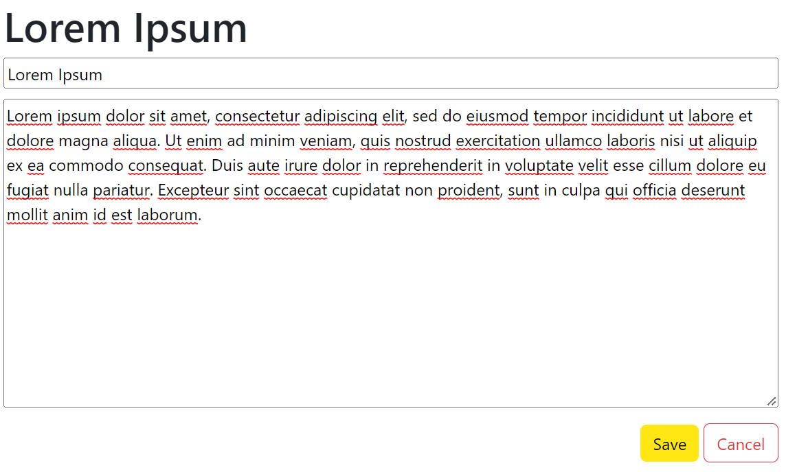
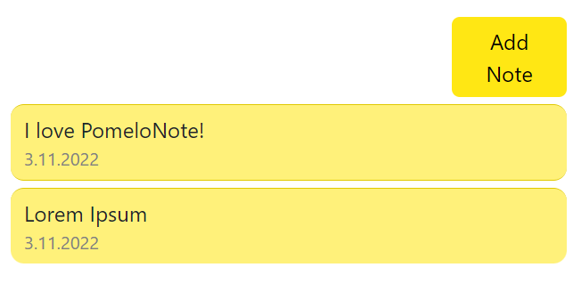

# Pomelo Note

This is the best open source note app you will ever find.

# Login
When first entering the app, you will need to login. If you haven't got an account you may consider [registering](#register), or just not using the app at all.

# Register
A username, an email and a password that's all you need. If you are missing one of those, just don't use the app at all. 

# Editor

# Listing

# Delete

